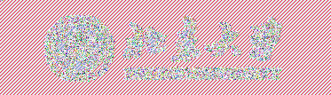

#基于sm4 ecb、cbc模式的图片加密解密。
## 1. 实现思路
加密：将png图片转化为rgba, 使用ecb/cbc模式sm4加密成 ecb/cbc.rgba,再将ecb/cbc.rgba转换成png图片。
解密：将加密后的png图片转换成rgba,使用ecb/cbc模式sm4解密成decrypt-ecb/cbc.rgba, 再将decrypt-ecb/cbc.rgba转换成png图片。
## 2. 操作步骤
  
    convert -depth 8 sm4.PNG sm4.rgba
    gmssl enc -sms4-ecb -e -in sm4.rgba -out sm4_ecb.rgba
    gmssl enc -sms4-cbc -e -in sm4.rgba -out sm4_cbc.rgba
    identify sm4.PNG
    convert -size 373x107 -depth 8 sm4_ecb.rgba sm4_ecb.png
    convert -size 373x107 -depth 8 sm4_cbc.rgba sm4_cbc.png
    gmssl sms4-cbc -d -in sm4_ecb.rgba -out sm4_decrypt_ecb.rgba
    gmssl sms4-ecb -d -in sm4_ecb.rgba -out sm4_decrypt_ecb.rgba
    convert -size 373x107 -depth 8 sm4_decrypt_ecb.rgba sm4_decrypt_ecb.png
    convert -size 373x107 -depth 8 sm4_decrypt_cbc.rgba sm4_decrypt_cbc.png 
    注： convert图片格式转化。
         identify 查看图片信息
         gmssl 加密解密

## 3.运行结果
原图

### 3.1 基于ECB模式的加解密
ECB加密后图片

ECB解密后图片

### 3.2 基于CBC模式的加解密
CBC加密后图片

CBC解密后图片

